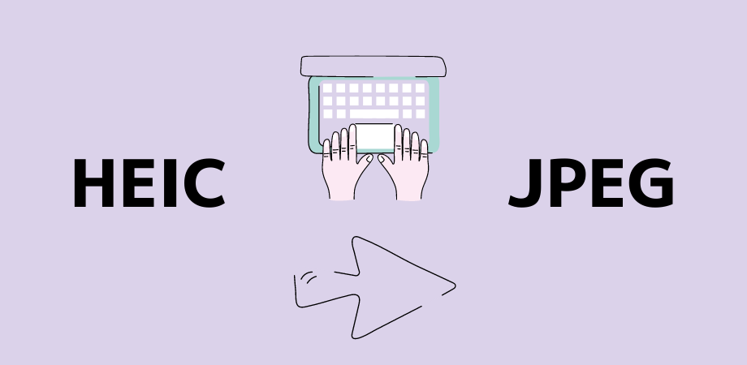

# HEIC to JPEG

As an iPhone/Mac user, I often find annoying that the High Efficiency Image File (HEIC) format is not compatible with many web services when uploading them.

Therefore, that made me explore a way to convert all of them which are located under a certain directory using [heic-convert](https://www.npmjs.com/package/heic-convert).

## How to use

### 1. Clone this repository and install npm

`git clone` and `npm install`

### 2. Place HEIC files

Under `heic/` directory, move or copy & paste your HEIC files that you want to convert to JPEG

### 3. Run the command

Type `node to-jpg-all.js` in your Terminal

#### Bonus:

If you want to convert a particular file at a time, you could also use `to-jpg.js`

In that case, you simply replace the parameter of the immediate function to your file name without an extension.

Then run `node to-jpg.js`

(Actually, this bonus is pretty much the same as the instruction in the documentation)
